# DashList

#### Video Demo: https://youtu.be/a0Gxhq8n-Vk

#### Description:

DashList is a personal media tracking web application built with **Flask** that lets users organize movies, TV shows, and books in one place. Whether you're planning what to watch next, keeping track of your current reads, or revisiting your favorites, DashList makes managing your entertainment library simple and intuitive.

## Features

* Secure user authentication
* Search for movies and TV shows using the **TMDB API**
* Search for books using the **Google Books API**
* Add media to your personal library
* Organize media with custom statuses:

  * Planned
  * Ongoing
  * Completed
  * Dumpped
* Rate and review completed media
* Filter your library by media type and status
* Personal dashboard with library statistics
* Edit or remove media entries
* Responsive interface for desktop and mobile
* Built-in dark mode

## Tech Stack

**Backend**

* Python
* Flask
* SQLite

**Frontend**

* HTML
* CSS
* Bootstrap
* JavaScript

**APIs**

* TMDB API
* Google Books API

## Live Demo

**Website:** [DashList](https://dashlist.onrender.com)

## Screenshots

<h3>Login</h3>

    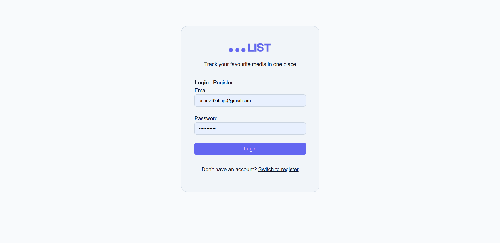

<h3>Register</h3>

    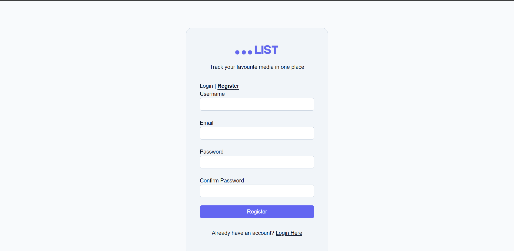

<h3>Dashboard</h3>

    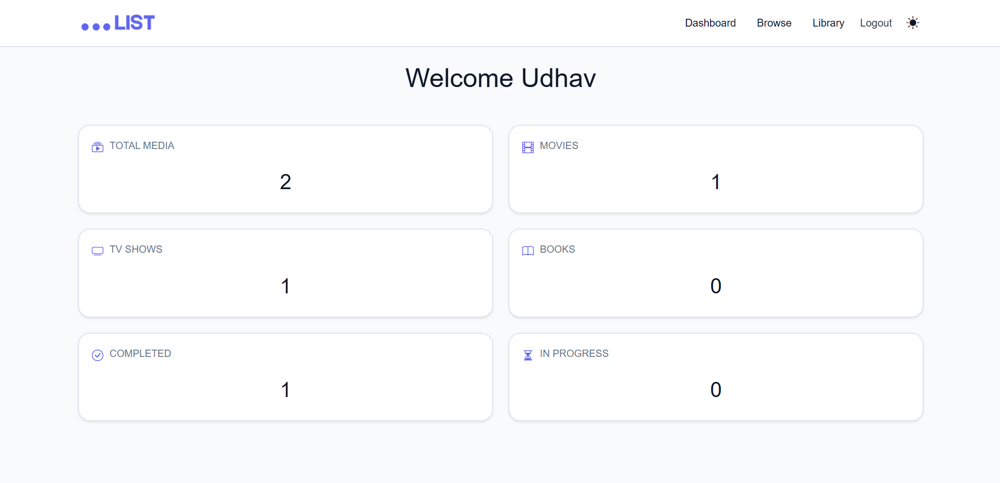

<h3>Browse</h3>

    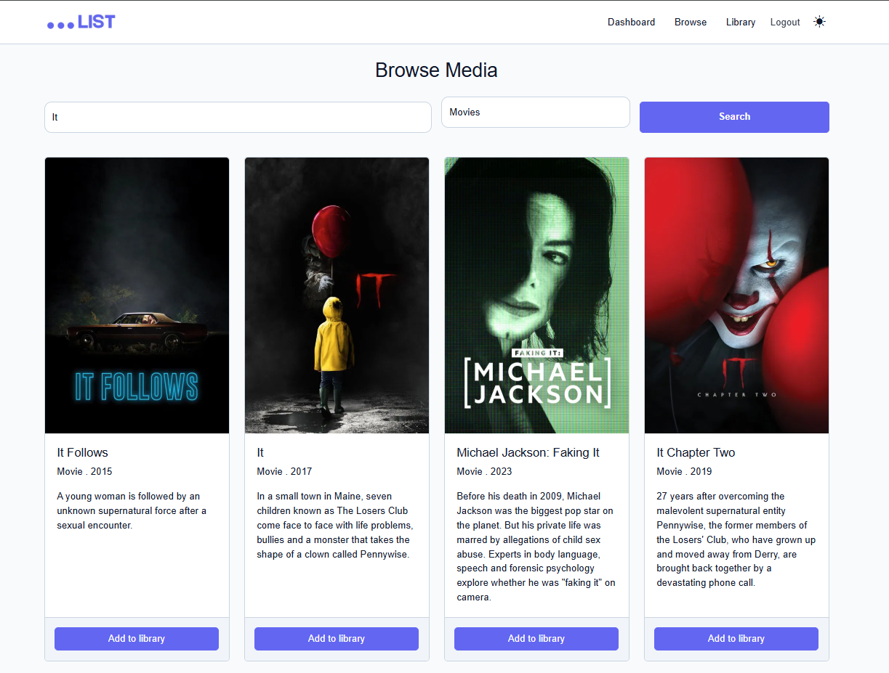
    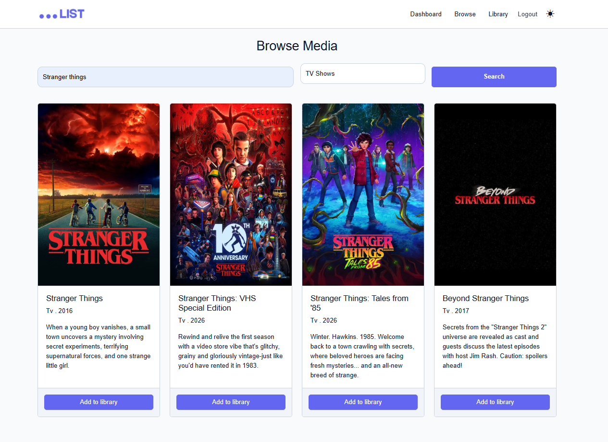
    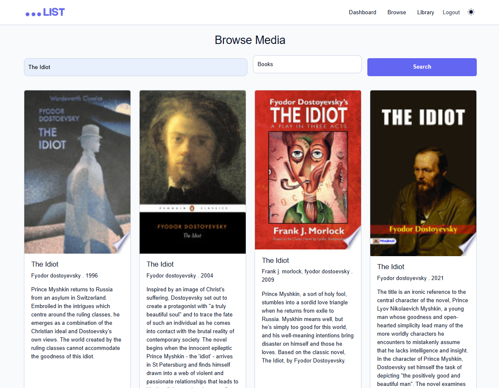

<h3>Library</h3>

    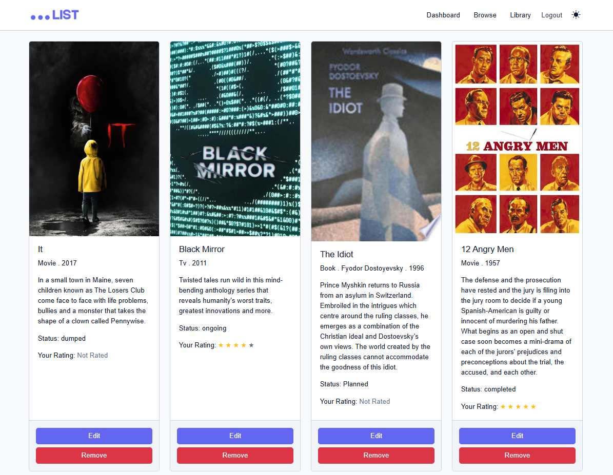
    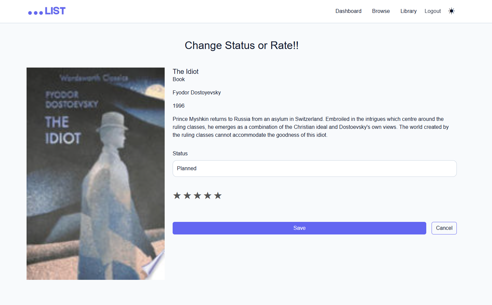

<h3>Dark Mode</h3>

    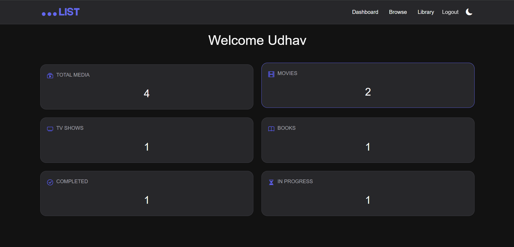
    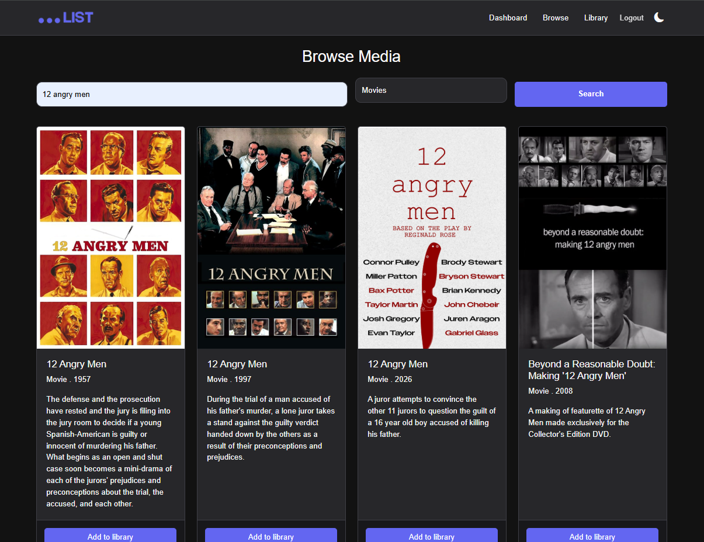
    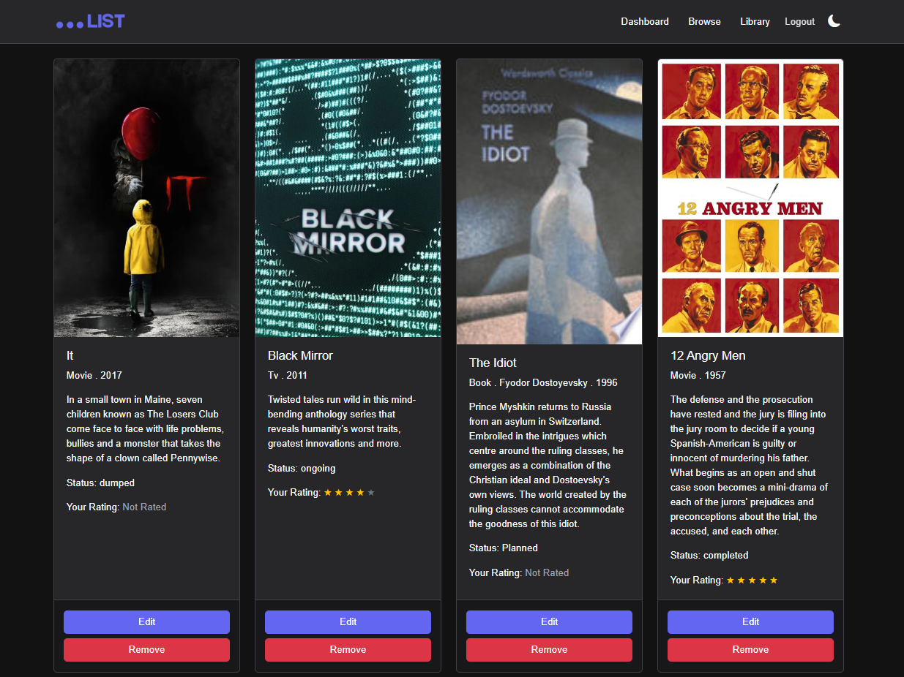
    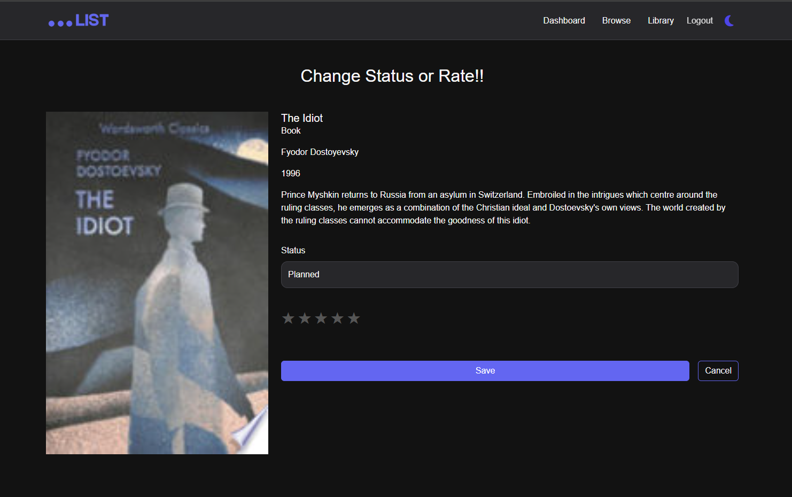

## Future Improvements

* Personalized recommendations
* Custom collections and playlists
* Friend sharing and recommendations
* Import/Export library
* Advanced search and filtering
* Reading and watching analytics

## License

This project was developed as the **CS50 Final Project** and is intended for educational purposes.

## Deployment Notes

The live demo is hosted on Render's free tier using SQLite

Since Render's free web services do not support persistent disks, the SQLite databases is stored on an ephmeral filesystem. As a result, user accounts and media ;ibraries in the live demo may occasionally reset after service restarts or redepolyments.

This is a limitation of hosting environment rather than application itself.

## Author

**Udhav Ahuja**
